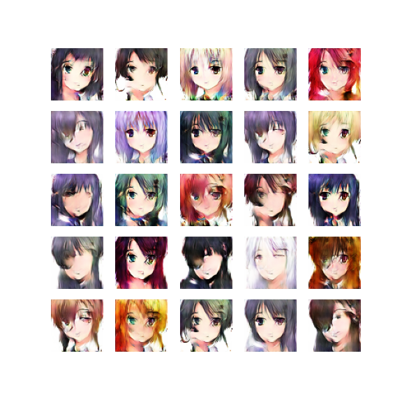
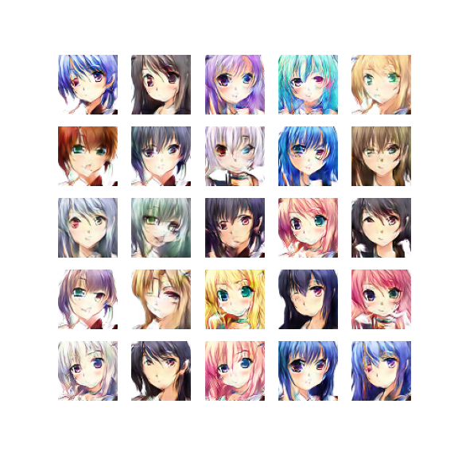

# Generating Anime  (DCGAN)

This repository centers on the notebook [Generating_Anime.ipynb](Generating_Anime.ipynb), which builds and trains a DCGAN to generate `64x64` RGB anime faces and evaluates quality with FID.

## Sample Outputs

### Training Progress Snapshots

Epoch 0  

Epoch 5000  

Epoch 9000  

### Animated Progress

## What the Notebook Does

1. Loads and preprocesses anime images (`64x64`, RGB).
2. Builds a **Generator** (noise vector `100` -> image).
3. Builds a **Discriminator** (binary real/fake classifier).
4. Combines both into a GAN and trains with alternating updates.
5. Periodically saves generated image grids.
6. Computes FID using InceptionV3 (`include_top=False`, `pooling='avg'`, `75x75` inputs).
7. Repeats training/evaluation on a second dataset (`selfie2anime`-style `Train/*.jpg`).

## Repository Layout

- `Generating_Anime.ipynb` - Main training + evaluation workflow.
- `generatedFaces/` - Sample generated snapshots included in this repo.
- `results/` - Charts, GIF, and summary artifacts.

## Environment

The notebook is written for **Google Colab + TensorFlow 1.x style runtime** (`%tensorflow_version 1.x`) and uses Keras APIs.

Main imports used:

- `tensorflow`, `keras`
- `numpy`, `matplotlib`, `opencv-python`, `glob`, `PIL`
- `scipy`, `scikit-image`

If running locally, use a compatible TensorFlow/Keras environment and adapt Colab-specific cells (`drive.mount`, `%tensorflow_version`).

## Dataset Expectations

### Dataset 1 (Anime Faces)

Notebook cells expect:

- Zip at: `/content/drive/MyDrive/anime/anime.zip`
- Extracted images at: `data/data/*.png`

### Dataset 2 (Selfie2Anime-style)

Notebook later expects:

- Images at: `Train/*.jpg`

## Training Configuration in Notebook

From the current notebook code:

- Noise vector size: `100`
- Image size: `64x64x3`
- Optimizer: `Adam(1e-4, beta_1=0.5)` in combined GAN setup
- Example run 1: `train(..., epochs=10000, batchSize=256, metricsUpdate=200, saveImgs=1000)`
- Example run 2: `train(..., epochs=2000, batchSize=256, metricsUpdate=200, saveImgs=100)`

## Outputs

During training, generated grids are saved as:

- `fakeFaces/Faces_<epoch>.png`

Model persistence cells save to Google Drive paths, for example:

- `/content/drive/My Drive/Colab Notebooks/generator/...`
- `/content/drive/My Drive/Colab Notebooks/discriminator/...`

This repo also includes pre-generated artifacts in `generatedFaces/` and `results/`.

## Quick Run Flow

Open the notebook and execute in order:

1. Imports + Drive mount.
2. Unzip/load dataset.
3. Build generator/discriminator/GAN.
4. Run training.
5. Save/load weights.
6. Plot accuracy/loss.
7. Compute FID.
8. (Optional) Repeat with second dataset.

## Notes / Caveats

- Create the `fakeFaces/` directory before training if it does not exist.
- `calculateFid(model, image1, image2)` currently uses global variables (`images1`, `images2`) inside the function body.
- `train(..., saveModel=...)` defines `saveModel` but does not currently use it in the loop.

## Credits

Original notebook references ideas/tools from TensorFlow, PyTorch, Medium, and Kaggle resources.
